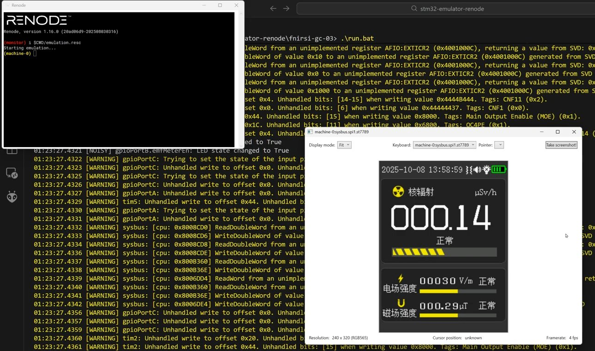

(click for video)

# STM32 Emulator Renode

STM32 Emulator Renode is an STM32 emulator designed for simulating firmware typically found in consumer electronic devices.

The project is inspired by the great [STM32 Emulator](https://github.com/nviennot/stm32-emulator) and extends it by leveraging the powerful capabilities of the [Renode](https://renode.io/) embedded systems simulator.

## Installation under Windows

1. Download the latest **portable Renode release** from the official repository: https://github.com/renode/renode/releases
2. Run the provided examples from the command line using `run.bat`. You may need to adjust the script to point to your local Renode installation.
